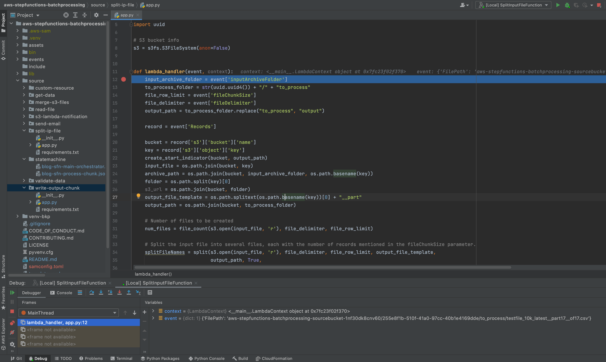

# Creating AWS Serverless batch processing architectures

This project shows how to use [AWS Step Functions](https://aws.amazon.com/step-functions/) features and integrations to orchestrate a batch processing solution. We use two Steps Functions workflows to implement batch processing, with one workflow splitting the original file and a second workflow processing each chunk file.


## Supporting Blog Posts

[Creating AWS Serverless batch processing architectures](https://aws.amazon.com/blogs/compute/creating-aws-serverless-batch-processing-architectures/)

## Architecture


1. The file upload to an [Amazon S3](https://aws.amazon.com/s3/) bucket triggers the S3 event notification. It invokes the [AWS Lambda](https://aws.amazon.com/lambda/) function asynchronously with an event that contains details about the object.
2. Lambda function calls the Main batch orchestrator workflow to start the processing of the file.
3. Main batch orchestrator workflow reads the input file and splits it into multiple chunks and stores them in an S3 bucket.
4. Main batch orchestrator then invokes the Chunk Processor workflow for each split file chunk.
5. Each Chunk processor workflow execution reads and processes a single split chunk file.
6. Chunk processor workflow writes the processed chunk file back to the S3 bucket.
7. Chunk processor workflow writes the details about any validation errors in an [Amazon DynamoDB](https://aws.amazon.com/dynamodb/) table.
8. Main batch orchestrator workflow then merges all the processed chunk files and saves it to an S3 bucket.
9. Main batch orchestrator workflow then emails the consolidated files to the intended recipients using [Amazon Simple Email Service](https://aws.amazon.com/ses/).

### AWS services used in the solution
* [AWS Step Functions](https://aws.amazon.com/step-functions/)
* [AWS Lambda](https://aws.amazon.com/lambda/)
* [Amazon DynamoDB](https://aws.amazon.com/dynamodb/)
* [Amazon API Gateway](https://aws.amazon.com/api-gateway/)
* [Amazon S3](https://aws.amazon.com/s3/)
* [Amazon Simple Email Service](https://aws.amazon.com/ses/)

## Prerequisites
* [AWS account](https://aws.amazon.com/free/?trk=ps_a134p000003yBfsAAE&trkCampaign=acq_paid_search_brand&sc_channel=ps&sc_campaign=acquisition_US&sc_publisher=google&sc_category=core&sc_country=US&sc_geo=NAMER&sc_outcome=acq&sc_detail=%2Baws%20%2Baccount&sc_content=Account_bmm&sc_segment=438195700994&sc_medium=ACQ-P|PS-GO|Brand|Desktop|SU|AWS|Core|US|EN|Text&s_kwcid=AL!4422!3!438195700994!b!!g!!%2Baws%20%2Baccount&ef_id=Cj0KCQjwsuP5BRCoARIsAPtX_wEmxImXtbdvL3n4ntAafj32KMc_sXL9Z-o8FyXVQzPk7w__h2FMje0aAhOFEALw_wcB:G:s&s_kwcid=AL!4422!3!438195700994!b!!g!!%2Baws%20%2Baccount&all-free-tier.sort-by=item.additionalFields.SortRank&all-free-tier.sort-order=asc)
* [AWS SAM CLI](https://docs.aws.amazon.com/serverless-application-model/latest/developerguide/serverless-sam-cli-install.html)
* [Python 3](https://www.python.org/downloads/)
* An [AWS Identity and Access Management](http://aws.amazon.com/iam) (IAM) role with appropriate access.  
* [Docker](https://docs.docker.com/get-docker/) (Docker is a prerequisite only for testing your application locally or using the --use-container option.)
  
### Local Development in an Integrated development environment
* PyCharm (You are free to use any of your favourite IDE or use the cli)
* [AWS Toolkit for PyCharm](https://aws.amazon.com/pycharm/) (Only needed if you are using PyCharm as your IDE, AWS Toolkit for PyCharm is an open source plug-in for the PyCharm IDE that makes it easier to create, debug, and deploy Python applications on Amazon Web Services)

## Project structure
```
aws-stepfunctions-batchprocessing/
├── .aws-sam - This is used to save the deployment package related files which the SAM CLI builds
├── assets - This has the image files used for the README.md
├── events - Invocation events that you can use to invoke the function. You can create an event file for each function and populate it with the event which the Lambda function will expect. 
├── source
    ├── statemachine - AWS Step Functions state machines.
    ├── split-ip-file - Main batch orchestrator: Splits the input file into multiple chunks.
    ├── merge-s3-files - Main batch orchestrator: Takes each of the processed chunks and then merges them together.
    ├── send-email - Main batch orchestrator: Creates a S3 presigned URL for the merged S3 file and sends email to the recipients.
    ├── read-file - Chunk processor: Reads each chunk and converts them into an array of JSON objects.
    ├── validate-data - Chunk processor: Validates each record from each row and outputs if the record is valid or not.
    ├── get-data - Chunk processor: This is a backing function for the API gateway, this is a test function to simulate the process of enriching the data, we fetch the data from a sample DynamoDB table.
    ├── write-output-chunk - Chunk processor: This function writes the processed output chunk to the S3 bucket.
    ├── s3-lambda-notification - This function is configured as an S3 notification handler which is called when a object is created in S3 and is reponsible for calling the Main batch orchestrator workflow.
    ├── custom-resource -
        ├── app.py - This function is responsible for adding an S3 event notification to the SourceBucket to trigger our lambda function, this notification is not added in the SAM template itself as it causes a circular dependency. This function also loads the FinancialTable DynamoDB table with initial data which will store the data that is needed by our api service (source/get-data/app.py). This is only used for the purpose of this example.
        ├── cfnresponse.py - This file is used for the cfnresponse module for our custom-resource. The cfn-response module is available only when you use the ZipFile property to write your source code. It isn't available for source code that's stored in Amazon S3 buckets, since we are not using the ZipFile property for our custom resource we have to provide this module. 
└── template.yaml - A template that defines the application's AWS resources.
```
Refer [cfnresponse](https://docs.aws.amazon.com/AWSCloudFormation/latest/UserGuide/cfn-lambda-function-code-cfnresponsemodule.html) for more details on the cfnresponse module. 

Refer [ZipFile](https://docs.aws.amazon.com/AWSCloudFormation/latest/UserGuide/aws-properties-lambda-function-code.html) for more details.

## Solution Deployment Walkthrough
At a high-level, here are the steps you will follow to get this solution up and running.

1. Deploy the solution using PyCharm (or any other IDE) and an appropriate AWS Toolkit.
2. Deploy the solution using SAM CLI (if step 1 is not used).
3. Test the solution.

Detailed steps are provided below:
### 1. Deploy the solution using PyCharm and AWS Toolkit

Download the code from the [GitHub](https://github.com/aws-samples/aws-serverless-batch-architecture) location.

```
 git clone https://github.com/aws-samples/aws-serverless-batch-architecture
```

You can follow the steps [here](https://www.jetbrains.com/help/pycharm/manage-projects-hosted-on-github.html) to Clone the project from GitHub.

You should be able to see the project as shown here, please take a moment to review the code structure:


If you have not already. please [Setup your AWS credentials for the AWS Toolkit](https://docs.aws.amazon.com/toolkit-for-jetbrains/latest/userguide/setup-credentials.html)

Right Click on the project and select Deploy Serverless Application as shown in the screenshot below:


Deploy Serverless Application dialog will open up as shown below:


Enter the name of the stack in the "Create Stack" input:

Make a note of the Template parameters:

- **SESSender**: The sender email address for the output file email.
- **SESRecipient**: The recipient email address for the output file email.
- **SESIdentityName**: An email address or domain that Amazon SES users use to send email.
- **InputArchiveFolder**: Amazon S3 prefix in the SourceBucket where the input file will be archived after processing.
- **FileChunkSize**: Size of each of the chunks, which is split from the input file. For this use case the chunk size of each file is around 600 rows i.e. the input file is split into multiple files with each file having 600 rows, the desired chunk size is passed in the event payload to the Main orchestrator workflow. The split chunk file is then passed as a payload to the chunk processor workflow, executions that pass large payloads of data between states can be terminated if the data you are passing between states could grow to over the maximum payload size of 262,144 bytes. You will have to adjust this value based on the data in the input file.
- **FileDelimiter**: Delimiter of the CSV file (for example, a comma).

Select an existing S3 bucket for storing the deployment package, you can alternatively create a new S3 bucket.

Keep rest of the options as shown.

You will see the progress of the deployments as shown in the screenshot below:


After a few minutes you will see that the stack is deployed as shown below:


Note here that after the stack is created, a [custom resource](source/custom-resource/app.py) is used to do 2 things:
- Add an S3 event notification to the SourceBucket to trigger our lambda function, this is not done in the template itself as it causes a circular dependency because our notification [lambda function](source/s3-lambda-notification/app.py) depends on the BlogBatchMainOrchestrator as well as the S3 bucket.
- Loads the DynamoDB table (FinancialTable) with initial data which stores the data that is needed by our [api service](source/get-data/app.py). This is only used for the purpose of this example.

### 2. Deploy the solution using AWS SAM CLI (if step 1 is not used)
Refer the [Supporting Blog](https://aws.amazon.com/blogs/compute/creating-aws-serverless-batch-processing-architectures/) post for instructions.

### 3. Testing the solution
Refer the [Supporting Blog](https://aws.amazon.com/blogs/compute/creating-aws-serverless-batch-processing-architectures/) post for instructions. 

#### Checking the output
Refer the [Supporting Blog](https://aws.amazon.com/blogs/compute/creating-aws-serverless-batch-processing-architectures/) post for instructions. 

## Debug your AWS Lambda Function

Start by adding the configuration as shown in the screenshot below:


Make the selections as shown in the screenshot below:


1. Select the **From template** option
2. Browse to the template.yaml within the aws-stepfunctions-batchprocessing directory.
3. Select the function that you want to debug, this drop-down will list all the functions that are present in the template.yaml.
4. Select the Input to the Lambda function, here you can pass the event for the Lambda function as text or in an input file. For the purpose of this example we use an event file. You can populate this file with whatever event that is expected by your Lambda function
5. Click OK to save the configuration



1. Set a break point by clicking on the area between the line number and the code.
2. Click on the Debug icon.
3. In a few minutes the debugging session should start, you can also perform additional debugger actions through the Debug tool window.

## Cleanup

To delete the application stack using the AWS CLI you can run the following command (replace stack-name with your actual stack name). 
Note: Deletion of the stack could fail if the SourceBucket is not empty, cleanup the files in the SourceBucket if they are not needed.

```bash
aws cloudformation delete-stack --stack-name <stack-name>
```
You can also delete the CloudFormation stack through the PyCharm IDE, AWS Explorer pane as shown below:


Right Click on your stack name and select Delete stack.


